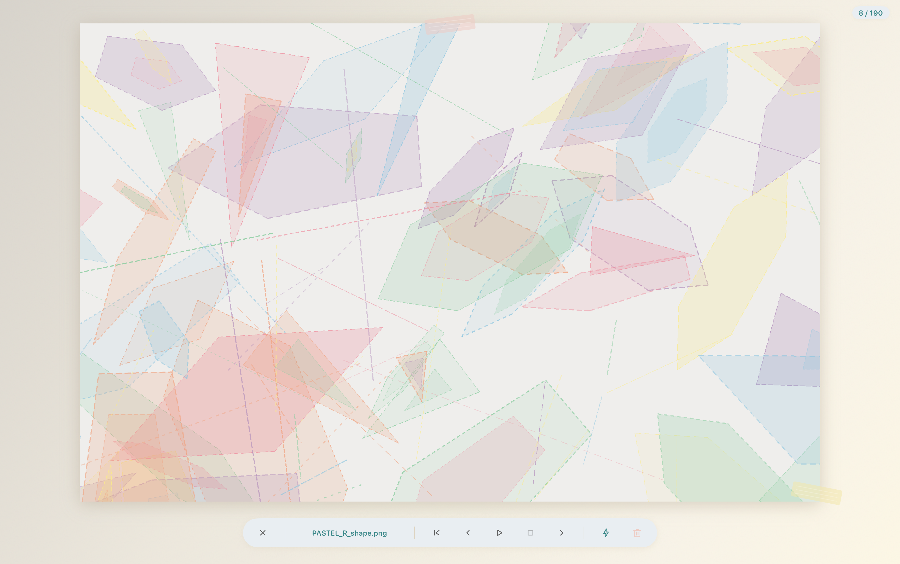

# Picture Viewer

A native macOS application for browsing pictures in a sketchbook-style interface with GPU-composited page-turn animations.

Built with Swift, SwiftUI, and Core Animation. Reads images from the user's Pictures folder and displays them in a pastel-toned gallery with a fullscreen slideshow featuring flip, curl, and bend transitions — all rendered on the compositor thread with zero jank.

## Screenshots

| Gallery | Slideshow |
|---------|-----------|
|  |  |

## Requirements

- macOS 14+ (Sonoma)
- Swift 5.9+
- [Task](https://taskfile.dev) (optional, for `task dev:run` commands)

## Build & Run

```sh
# Build
swift build

# Run as .app bundle (requires task runner)
task dev:run
```

## License

MIT
